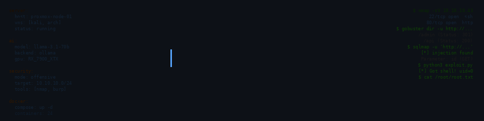
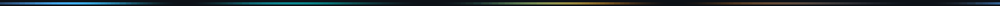
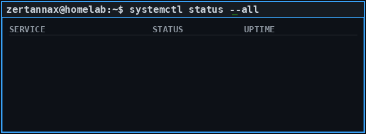

<div align="center">

  <!-- ╔══════════════════════════════════════════════════════════════╗ -->
  <!-- ║    ANIMATED TERMINAL BANNER — Clean Hacker Aesthetic        ║ -->
  <!-- ╚══════════════════════════════════════════════════════════════╝ -->
  

  <!-- TYPING ANIMATION -->
  

  <br><br>

  <!-- SOCIAL BADGES -->
  <a href="https://github.com/zertannax">
    
  </a>
  
  

  <br><br>

  <!-- TECH STACK -->
  <a href="https://archlinux.org/">
    
  </a>
  <a href="https://www.proxmox.com/">
    
  </a>
  <a href="https://docker.com/">
    
  </a>
  <a href="https://python.org/">
    
  </a>
  <a href="https://www.kali.org/">
    
  </a>
  <a href="https://ollama.com/">
    
  </a>

</div>

<!-- ANIMATED SEPARATOR -->


<br>

<div align="center">

### `$ whoami`

</div>

```yaml
handle: zertannax_
role: [Infrastructure Engineer, AI Hacker, Security Researcher]
location: Homelab / On-Prem Only
philosophy: "I learn by shipping"
stack: "Build fast. Break things. Fix them better."
uptime: "24/7/365"
```

> **Building and breaking** things across **self-hosted infrastructure**, **local AI/ML stacks**, and **offensive security**. From Proxmox clusters to fine-tuned LLMs running on consumer hardware — everything lives on-prem. No cloud, no compromises.

<!-- SYSTEM STATUS TERMINAL -->
<div align="center">
  
</div>

<!-- ANIMATED SEPARATOR -->


---

<div align="center">

### 🛠️ Infrastructure & Stack

</div>

<table align="center">
<tr>
<td width="50%" valign="top">

#### 🖥️ **Homelab Infrastructure**
```yaml
Virtualization:  Proxmox VE · KVM · LXC
Containers:      Docker · Docker Compose · Portainer
Networking:      MikroTik · WireGuard · Traefik · Pi-hole
Storage:         TrueNAS · ZFS · Nextcloud · Syncthing
Monitoring:      Grafana · Prometheus · Uptime Kuma
IaC:             Terraform · Ansible · GitLab CI
```

#### 🤖 **AI / ML Stack**
```yaml
Inference:    Ollama · llama.cpp · vLLM
Frameworks:   PyTorch · Transformers · LangChain · FastAPI
Vector DB:    ChromaDB · Redis · pgvector
Fine-tuning:  LoRA · QLoRA · Unsloth
Hardware:     RX 7900 XTX · RTX 4090 · ROCm · CUDA
```

</td>
<td width="50%" valign="top">

#### 🔐 **Offensive Security**
```yaml
Distro:       Kali Linux · Parrot OS
Scanning:     Nmap · Masscan · Nikto
Web:          Burp Suite · WPScan · SQLMap · Feroxbuster
Exploitation: Metasploit · Cobalt Strike (lab)
AD Pentest:   BloodHound · Impacket · CrackMapExec · Responder
OSINT:        Maltego · theHarvester · Recon-ng
```

#### 💻 **Dev Environment**
```yaml
OS:           Arch Linux (daily driver)
WM:           Hyprland · Wayland · HyDE
Editor:       Neovim · VS Codium
Terminals:    Alacritty · Kitty · tmux
Shell:        Zsh · Powerlevel10k · fzf
Languages:    Python · Bash · VBA · YAML · HCL
```

</td>
</tr>
</table>

<!-- ANIMATED SEPARATOR -->


---

<div align="center">

### 🎯 Current Focus

</div>

<div align="center">

| 🔥 **Active Projects** | 🧠 **Learning** | 🎯 **Goals 2025** |
|:---|:---|:---|
| 🏠 Fully automated IaC homelab | 🧠 Local LLM fine-tuning (LoRA/QLoRA) | 🎓 OSCP Certification |
| 🤖 Self-hosted AI assistant stack | 🔐 Active Directory pentesting | 🏆 HTB Pro Hacker |
| 🔍 CTF platform automation | ⚡ GPU optimization (ROCm vs CUDA) | 📝 Publish security research |
| 🐧 Hyprland rice & dotfiles | 🐳 Kubernetes migration (k3s) | 🤖 Open-source AI tooling |

</div>

<!-- ANIMATED SEPARATOR -->


---

<div align="center">

### 📊 GitHub Analytics

</div>

<div align="center">

  <!-- STATS -->
  
  

  <br>

  <!-- STREAK -->
  

  <br><br>

  <!-- TROPHIES -->
  

  <br><br>

  <!-- ACTIVITY GRAPH -->
  

</div>

<!-- ANIMATED SEPARATOR -->


---

<div align="center">

### 🏆 Platforms & Certifications

</div>

<div align="center">

  <a href="https://app.hackthebox.com/">
    
  </a>
  <a href="https://tryhackme.com/">
    
  </a>
  <a href="https://www.offensive-security.com/proving-grounds/">
    
  </a>
  <a href="https://www.credly.com/">
    
  </a>

  <br><br>

</div>

<!-- ANIMATED SEPARATOR -->


---

<div align="center">

<!-- ANIMATED SEPARATOR -->

<div align="center">

### 🔥 Latest Activity

  <!--START_SECTION:activity-->
  <!-- This section auto-updates via GitHub Actions -->
  <!--END_SECTION:activity-->

</div>

---

<!-- ANIMATED FOOTER -->


<div align="center">

  ### *"Build fast. Break things. Fix them better."*

  

  <br><br>

  <sub><sup>Generated with ❤️ and way too much caffeine</sup></sub>

</div>
